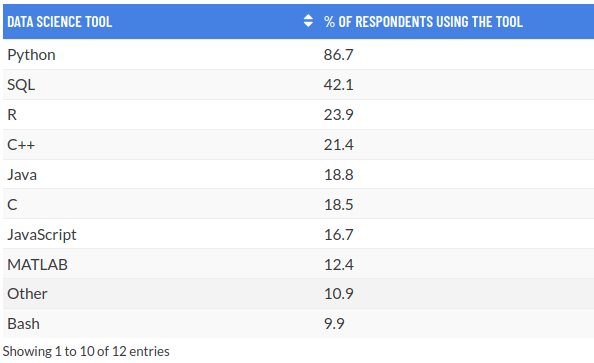
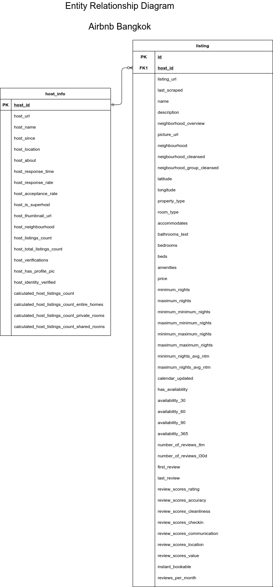

# Airbnb Data Analytics

**A step-by-step data analytics with SQL, R, and Python.**

In the world with increasing data availability, it is become a norm to store and collect data from a cloud database instead of using a local file when you are part of a start up or large corporation. Several service, such as Google Cloud Platform or Microsoft Azure provide us with a cloud storage service to store a large dataset. Most of the current database system use SQL to store and collect this data. Therefore, understanding how to write a command or a query using SQL is currently one of the top skills required in data-related job, espescially for a data analyst and data scientist. The following graph is the result of [2020 Data Science and Machine Learning Survey](https://research.aimultiple.com/data-science-tools/).

To learn more about how to run an SQL query, we will use one of the most common database management system: MySQL. On this occasion, I will guide you on how to do the following things with MySQL:

- Create a database with MySQL server
- Create multiple SQL tables
- Use R and python to connect to MySQL server
- Insert data into SQL table
- Write query to collect and analyze data from SQL database

For a quick introduction about SQL if you are not familiar with SQL, you can visit [this website](https://www.learnsqlonline.org/) and just read the welcome page or you can try some practice and come back here later.

# MySQL Server

There are a lot of options for you to start creating a database, either using common cloud service such as Google Cloud Platform or Microsoft Azure, or you can also try setting up a local mysql server in your device. However, setting up a database on these can be a quite long process. Since our goal is focus on preparing data and store with SQL, we will use a free hosting website with [db4free](https://db4free.net/). You can also use SQLite to store a small database as well.

This website help us set a free and small MySQL server for us to practice. You just need to register with your email and enter the following information:

- The name of your MySQL database
- Your username to login
- Your password to login
- Your email address for validation

# Data

Data are acquired from [Airbnb Official Website](http://insideairbnb.com/get-the-data.html) for Room Listing in Bangkok, Thailand. The dataset that contain the detailed information about listing or room posted on airbnb. One host can have multiple listings. For the detailed information regarding each column, you can check the description for each column in [this spreadsheet](https://docs.google.com/spreadsheets/d/1iWCNJcSutYqpULSQHlNyGInUvHg2BoUGoNRIGa6Szc4/edit?usp=sharing).

To illustrate the relation between each data, we will draw an **Entity Relationship Diagram (ERD)**. An ERD is often used to help data engineer to design a database and show the relation between each table. Open image in new tab if you want to zoom in.

# Research Question

The following is my research questions regarding the Airbnb Room Listing and Host:

## Room Listing

- What is the most common room type available?
- What is the top and bottom 10 property type based on average price?
- What is the top and bottom 10 property type based on review score?
- What is the most common amenities provided?
- Is there any correlation between room price and the review score?
- Room listing geographical distribution

## Host

- Who are the top 10 host based on revenue?
- Is there any difference in review score between superhost and normal host?
- Is there any difference in response rate between superhost and normal host?
- What is the most commonly verified host information?
- How is the number of host joined to Airbnb over time?

# Output

- [Connect and Insert Data to MySQL Server with R](https://rpubs.com/Argaadya/create_table_sql)
- [Airbnb Data Analysis](https://rpubs.com/Argaadya/airbnb_sql_analysis)
- [Live Demo Shiny Dashboard](https://argaadya.shinyapps.io/airbnb_analytics/)
