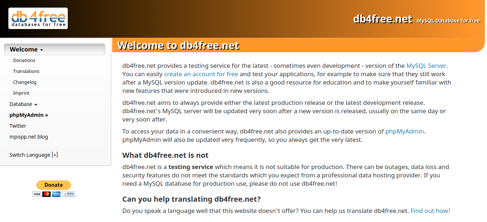

```{r setup, include=FALSE}
knitr::opts_chunk$set(echo = TRUE, message = F, warning =  F, fig.align = "center", out.width = "80%")
```

# Introduction 

In the world with increasing data availability, it is become a norm to store and collect data from a cloud database instead of using a local file when you are part of a start up or large corporation. Several service, such as Google Cloud Platform or Microsoft Azure provide us with a cloud storage service to store a large dataset. Most of the current database system use SQL to store and collect this data. Therefore, understanding how to write a command or a query using SQL is currently one of the top skills required in data-related job, espescially for a data analyst and data scientist. The following graph is the result of [2020 Data Science and Machine Learning Survey](https://research.aimultiple.com/data-science-tools/).

```{r echo=FALSE}
knitr::include_graphics("asset/survey.png")
```

To learn more about how to run an SQL query, we will use one of the most common database management system: MySQL. On this occasion, I will guide you on how to do the following things with MySQL:

- Create a database with MySQL server
- Create multiple table
- Use R to connect to MySQL server
- Insert data into SQL table 
- Write query to collect and analyze data from SQL database

For a quick introduction about SQL if you are not familiar with SQL, you can visit [this website](https://www.learnsqlonline.org/) and just read the welcome page or you can try some practice and come back here later.

# Set Up MySQL Server

There are a lot of options for you to start creating a database, either using common cloud service such as [Google Cloud Platform](https://help.appsheet.com/en/articles/3627169-create-a-mysql-database-hosted-in-google-cloud) or [Microsoft Azure](https://docs.microsoft.com/en-us/azure/mysql/flexible-server/quickstart-create-server-portal), or you can also try setting up a local mysql server in your device. However, setting up a database on these can be a quite long process. Since our goal is focus on preparing data and store with SQL, we will use a free hosting website with [db4free](https://db4free.net/). You can also use [SQLite](https://db.rstudio.com/databases/sqlite/) to store a small database as well. 



This website help us set a free and small MySQL server for us to practice. You just need to [register](https://db4free.net/signup.php) with your email and enter the following information:

- The name of your MySQL database
- Your username to login
- Your password to login
- Your email address for validation

# Library

The following is the required library that we will use throughout this post.

```{r message=FALSE}
# Data Wrangling
library(tidyverse)

# SQL Driver
library(RMySQL)
```

# Basic SQL

## Connect to MySQL Server

After you have set up the mysql server, now you can connect into the server with `RMySQL`. You need the following information from the server:

- host name
- port
- username
- password
- database name (dbname)

```{r eval=FALSE}
mydb <- dbConnect(MySQL(),
                  host = "db4free.net", # write "localhost" if you use a localhost
                  port = 3306,
                  user = "your_username",
                  password = "your_password",
                  dbname = "your_database"
)
```

## Create and Check Table

Let's check the connection and start with the basic. We will create a simple table of customer information with 3 columns:

- `customer_id`: ID of the customer with data type of integer (INT)
- `name`: name of the customer with data type of character (VARCHAR 100)
- `city`: city location of the customer with data type of character (VARCHAR 100)

____________

**Trivia**

VARCHAR(100) means that we state that this column has data type of character with maximum length of 100 characters.

____________

The following is the general SQL command for creating a table

> CREATE TABLE table_name(
column_1 type_data1,
column_2 type_data2,
)

```{r}
query <- "CREATE TABLE dummy_customer(
customer_id INT,
name VARCHAR(100),
city VARCHAR(100)
)"

query
```

You can send the query by using the `dbSendQuery()`.

```{r eval=FALSE}
dbSendQuery(mydb, # your connection
            query # SQL query
            )
```

You can check all available table in the database by using the following query. This will return all available table in your database in a dataframe format.

> SHOW TABLES

```{r}
dbSendQuery(mydb, "SHOW TABLES") %>% 
  fetch()
```

If you want to check the name and the type of each column in your data, you can use the following command.

> DESCRIBE table_name

```{r}
dbSendQuery(mydb, "DESCRIBE dummy_customer") %>% 
  fetch()
```

If you want to delete the table, you can run the following query.

> DROP TABLE table_name

```{r eval=FALSE}
dbSendQuery(mydb, "DROP TABLE dummy_customer")
```

# Data

We will use data of Thailand room listing from [Airbnb](http://insideairbnb.com/get-the-data.html). The dataset contain information about room or listing that is posted on Airbnb site in Bangkok, Central Thailand, Thailand.

We will use the `Listing` dataset that contain the detailed information about listing or room posted on airbnb. One host can have multiple listings. For the detailed information regarding each column, you can check the description for each column in [this spreadsheet](https://docs.google.com/spreadsheets/d/1iWCNJcSutYqpULSQHlNyGInUvHg2BoUGoNRIGa6Szc4/edit?usp=sharing).

The dataset can be further broken down into several parts. For example, in listing data there are several columns that store information about the host instead of the room/listing. In practice, we can reduce the number of required space for the database by separating the data about listing and the data about host, since a single host can have multiple listing. 

To illustrate the relation between each data, we will draw an **Entity Relationship Diagram (ERD)**. An ERD is often used to help data engineer to design a database and show the relation between each table. Open image in new tab if you want to zoom in.

```{r echo=FALSE}
knitr::include_graphics("asset/ERD_Airbnb.png")
```

On each table, you can have a column that contain a unique ID to identify each row in a table. This column is called as **Primary Key (PK)**. For example, in host_info table, a unique host should only stored once and there is no duplicate in the table. This host is identified by the `host_id` column. There is also a column that is called as **Foreign Key (FK)**. For example, the listing table has `id` as the primary key and `host_id` as the foreign key. This means that we can join the listing table with the host_info table by matching the `host_id` on the listing table with the `host_id` on the host_info table. 

The relation or the cardinality between table is illustrated by the sign at both end of the arrow. There are different cardinality in ERD, you can look at the detailed explanation [here](https://www.youtube.com/watch?v=QpdhBUYk7Kk). A host can have zero (no listing) or many listing, so the cardinality at the listing side is illustrated as *zero or many*. Naturally, a room listing can only be owned by a single host. There is no listing that is owned by different hosts. Therefore, the cardinality at the host_info side is illustrated as *one (and only one)*.

```{r echo=FALSE}

```

## Host

### Processing Host Table

Since the only table that has no foreign key is `host_info`, we will start creating and cleansing a host table from the listing data. Let's start by importing the listing data.

```{r }
df_listing <-  read.csv("data/listings.csv") 

cat( paste("Number of rows:", nrow(df_listing), "\n"))
cat( paste("Number of columns:", ncol(df_listing)))
```

Let's check the some of the content from the dataset.

```{r}
head(df_listing)
```

Some missing values are written as an empty string (`""`) or as `"None"`, therefore we will transform this value into explicit NA for R. 

```{r}
df_listing <- df_listing %>% 
  mutate_all( function(x) ifelse(x == "" | x == "None" | x == "N/A", NA, x) )
```

Let's check the information from the dataset.

```{r }
glimpse(df_listing)
```

The listing dataset contain information about each room listing or room posted on the airbnb website by the host.

A single host is identified by the `host_id` and may have multiple room in the listing. Let's check this hypothesis.

```{r }
# Count the number of listing for each host and get the top 10
df_listing %>% 
  count(host_id) %>% 
  arrange(-n) %>% 
  head(10)
```

As we have seen from the above output, several hosts even have hundreds of listing. For efficient storage in the database, we will separate information about the host, such as `host_id`, `host_url`, etc. from the information about the listing.

```{r}
df_host <- df_listing %>% 
  select(host_id:host_identity_verified, 
         calculated_host_listings_count:calculated_host_listings_count_shared_rooms)

glimpse(df_host)
```

Now we have 22 columns for the host and the rest is columns related to the individual listing.

There should be no duplicate host, so we will remove duplicated host.

```{r}
df_host <- df_host %>% 
  distinct()

print( paste("Number of rows:", nrow(df_host)) )
```

The next we do is preparing the dataset so they will have a proper data type in the database. You may have noticed that some columns should be have a boolean or logical data type, such as the `host_is_superhost`, `host_has_profile_pic`, and `host_identity_verified`. They contain string *t* if the value is *True* and *f* if the value is *False*. We will transform the data to the proper data type.

```{r}
df_host <- df_host %>% 
  mutate_at(vars(host_is_superhost, host_has_profile_pic, host_identity_verified),
            function(x) case_when(x == "t" ~ TRUE,
                                  x == "f" ~ FALSE,
                                  T ~ NA)
            )
```

The next thing that I want to clean up is the `host_verification` column that is in a list format like following sample.

```{r}
head(df_host$host_verifications)
```

We will clean them so they contain a simple string text. For example, the first row will be *email, phone, facebook, ...*.

```{r}
df_host <- df_host %>% 
  
  # remove ', [, and  ]
  mutate(host_verifications = str_remove_all(host_verifications, "[\\'\\[\\]]"))

head(df_host$host_verifications)
```

### Create Host Table

We will start creating a table for the database. Since there is no numeric or decimal value from the host data, we will assign all numeric value into integer. The next thing we need to do is to design a proper data type for the string text columns. We will check the maximum length of each string column in the host dataset.

```{r }
df_host %>% 
  select_if(is.character) %>% 
  lapply(FUN = function(x) max(nchar(x, keepNA = F))) %>% 
  as.data.frame() %>% 
  pivot_longer(cols = names(.),
               names_to = "column",
               values_to = "maximum_length") 
```

Now we can create a table named `host_info` with the following data type:

- INT: integer
- VARCHAR(n): String or character with maximum length of n
- DATE: date (format in YYYY-MM-DD)
- BOOLEAN: logical (TRUE or FALSE)

Make sure the number of character (n) in VARCHAR is bigger than the length of your data characters. For example, the maximum length of `host_location` is 125, so you can create a VARCHAR(200) or VARCHAR(500) just to make sure. Don't forget to assign `host_id` as the primary key for the table.

For more detailed information about different data type allowed by MySQL, you can check the following [manuals](https://dev.mysql.com/doc/refman/8.0/en/data-types.html).

```{r}
query <-  "CREATE TABLE host_info(
host_id INT,
host_url VARCHAR(50),
host_name VARCHAR(100),
host_since DATE,
host_location VARCHAR(500),
host_about VARCHAR(10000),
host_response_time VARCHAR(50),
host_response_rate VARCHAR(50),
host_acceptance_rate VARCHAR(50),
host_is_superhost BOOLEAN,
host_thumbnail_url VARCHAR(500),
host_picture_url VARCHAR(500),
host_neighbourhood VARCHAR(50),
host_listings_count INT,
host_total_listings_count INT,
host_verifications VARCHAR(500),
host_has_profile_pic BOOLEAN,
host_identity_verified BOOLEAN,
calculated_host_listings_count INT,
calculated_host_listings_count_entire_homes INT,
calculated_host_listings_count_private_rooms INT,
calculated_host_listings_count_shared_rooms INT,
PRIMARY KEY(host_id)
)"

query
```

After you have created the SQL query, you can execute them.

```{r eval=FALSE}
# Execute query
dbSendQuery(mydb, query)
```

You can run a query and get a result. For example, you can check data information about the `host_info` table.

```{r }
# sent query
res <- dbSendQuery(mydb, "DESCRIBE host_info") 

# get the result
out_db <- fetch(res) 

# free resource
dbClearResult(res)

# print result
out_db
```

If you want to check the content or the data from `host_info` table, you can use the following query, although for now the table is still empty because we don't insert anything yet into the table.

```{r eval=FALSE}
res <- dbSendQuery(mydb, "SELECT * FROM host_info") 

out_db <- fetch(res) 
dbClearResult(res)

out_db
```

### Insert Data to Host Table

Let's start inserting data into MySQL server. The generic formula to insert data into the table is as follows:

> INSERT INTO table_name (column_name) VALUES (value_for_each_column)

For example, if you have a table named **customer** that has `reviewer_id` and `reviewer_name` column, you can insert a row with the following query:

> INSERT INTO customer (reviewer_id, reviewer_name) VALUES (123, 'John Doe')

So we need to insert the name of the column and the respective value for each column. Let's start by preparing the column name into a single string.

```{r}
column_name <-  paste(names(df_host), collapse = ", ")

column_name
```

Next, we can prepare the value into a single string for each row. For example, the following is the input for the first row of the host data.

Just like when you read a csv file, an input for a single column is separated by comma (,) value by default. For example, input for the first column `host_id` is 266763, input for the second column is the string for `host_url`, etc. However, you may notice that at the middle of the string we have an extra comma from the `host_verifications` (email, phone, facebook) which should go into a single column. We need to clean the string so they can fit properly to how the SQL will read the data.

To get a clean values, we need to process the string column first with the following rules:

- A string should be started and ended with quotation mark (""), e.g. "email, phone, facebook", "Fransesca"
- Missing values (NA) should not be quoted and should be transformed to NULL for SQL
- Logical value should not be quoted

The following is the proper query for the value in a single row of data from multiple columns.

```{r }
# Convert value of each row into a single string
value_data <- df_host %>% 
  slice(1) %>% # take the first row as sample
  mutate_if(is.character, function(x) ifelse(is.na(x), NA,  x %>% 
                                               str_replace_all('"', "'") %>% # Replace all "" into '' in a string before joining
                                               paste0('"', . , '"') 
                                              )
            ) %>% 
  unlist() %>% 
  paste(collapse = ", ")

value_data
```

Now you can see that even if a column has internal comma, such as the `host_verifications`, they will not be a problem because we give a quotation mark for a string so the SQL will understand that the comma will not be read as a command to fill the next column.

Finally, We need to transform a missing value `NA` into explicit NULL since SQL only consisder NULL as the legitimate missing value.

```{r }
# Replace missing value with explicit NULL
value_data <- str_replace_all(value_data, "\\bNA\\b", "NULL") %>% # Replace NA to NULL
  str_replace_all('\\"NULL\\"', "NULL") # Remove "" from NULL

value_data
```

The full query for the first row is as follow:

```{r}
paste0("INSERT INTO host_info (", column_name, ") VALUES (", value_data , ")")
```

Let's prepare the data.

```{r}
df_host_new <- df_host %>% 
  mutate_if(is.character, function(x) ifelse(is.na(x), NA,  x %>% 
                                               str_replace_all('"', "'") %>% # Replace " with '
                                               paste0('"', . , '"')  # add " before and after string
                                              )
            )
```

You can insert multiple data at once with the following SQL format:

> INSERT INTO customer (reviewer_id, reviewer_name) 
VALUES (123, 'John Doe'),
VALUES (124, 'Jean Doe')

Let's prepare the value for each observation with the following function.

```{r}
value_data <- apply(df_host_new, MARGIN = 1, 
      function(x) x %>% 
        paste(collapse = ",") %>% # Join all column into single string
        str_replace_all("\\bNA\\b", "NULL") %>% # Replace NA with NULL
        str_trim() # Remove unnecessary whitespace
      )

# Check first 3 data
value_data %>% 
  head(3)
```

Finally, you will join all rows into a single, giant string. For example, the following is the query to insert the first 3 data.

```{r}
paste(value_data[1:3]) %>% 
  paste0("(", ., ")") %>% # Add bracket before and after string
  paste(collapse = ", ") %>% # Join all values into single string
  paste0("INSERT INTO host_info (", column_name, ") VALUES ", .)
```

We will create a function to simplify the process so that we can use the previous steps multiple times in a single line.

```{r}
insert_to_sql <- function(conn, table, data){
  
  column_name <-  paste(names(data), collapse = ", ")
  
  data_new <- data %>% 
    mutate_if(is.character, function(x) ifelse(is.na(x), NA,  x %>% 
                                                 str_replace_all('"', "'") %>% # Replace " with '
                                                 paste0('"', . , '"') # Add " before and after string
                                               )
              )
  
  value_data <- apply(data_new, MARGIN = 1, 
                      function(x) x %>% 
                        paste(collapse = ",") %>% # Join all column into single string
                        str_replace_all("\\bNA\\b", "NULL")  %>% # Create NULL from NA
                        str_trim() # remove unnecessary whitespace
                      )
  
  query_value <- paste(value_data) %>% 
    paste0("(", ., ")") %>% # Add bracket before and after string
    paste(collapse = ", ") %>% # Join all values into single string
    str_remove_all("\\\\") %>% # Remove \\ from string
    paste0("INSERT INTO ", table, "(", column_name, ") VALUES ", .)
  
  dbSendQuery(conn, query_value)
  
  cat("Data uploaded to MySQL\n")
}
```

Let's insert the data into the MySQL server.

```{r eval=FALSE}
# Insert all data to SQL
insert_to_sql(mydb, "host_info", df_host)
```

### Query the Host Table

Now we will try to do some query to the `host_info` table, starting with connect to the MySQL.

Let's try to get the first 10 observation from the `host_info` table. The **LIMIT** command is the same as **head()** in python and will give us the first n row.

```{r}
# sent query
res <- dbSendQuery(mydb, "SELECT * FROM host_info LIMIT 10") 

# get the result
out_db <- fetch(res) 

# free resource
dbClearResult(res)

out_db
```

You can try to do conditional filtering of the data. For example, let's try to get the first 5 host who is considered as a superhost. To create a condition, you can use **WHERE** command.

```{r}
# sent query
res <- dbSendQuery(mydb, "SELECT * FROM host_info WHERE host_is_superhost = TRUE LIMIT 5") 

# get the result
out_db <- fetch(res) 

# free resource
dbClearResult(res)

out_db
```

You can get the number of row in the data using `COUNT( * )`

```{r}
# sent query
res <- dbSendQuery(mydb, "SELECT COUNT(*) as frequency FROM host_info") 

# get the result
out_db <- fetch(res) 

# free resource
dbClearResult(res)

out_db
```

## Listing
### Processing Listing Table

We will do full analysis of the data and understand different kind of SQL command in another post. For now, we will finish inserting all data into the database. Let's continue processing the remaining column from the listing dataset.

```{r}
# Remove column related to host except host_id
df_new_listing <- df_listing %>% 
  select(-names(df_host)[-1])

glimpse(df_new_listing)
```

Some columns, such as the `calendar_updated`, `license`, and `bathrooms` are only consists of missing values. The `scrape_id` is also has no apparent meaning for now since we already has the `last_scraped` column to show us the lates date of scraping. These columns are not informative, so we will drop them.

```{r}
df_new_listing <- df_new_listing %>% 
  select(-c(license, calendar_updated, bathrooms, scrape_id))
```

Next, we will convert columns that should has a boolean/logical value, including `has_availability` and `instant_bookable`.

```{r}
df_new_listing <- df_new_listing %>% 
  mutate_at(vars(has_availability, instant_bookable),
            function(x) case_when(x == "t" ~ TRUE,
                                  x == "f" ~ FALSE,
                                  T ~ NA)
            )
```

We will continue by transforming the `price` column into decimal/numeric values by removing the dollar sign from the string.

```{r}
df_new_listing <- df_new_listing %>% 
  mutate(price = str_remove_all(price, "[$,]") %>% 
           as.numeric()
         )

head(df_new_listing$price)
```

Now we will continue transforming the `amenities` with the same treatment as the `host_verification` column from the host dataset.

```{r}
df_new_listing <- df_new_listing %>% 
  mutate(amenities = str_remove_all(amenities, "[\"\\'\\[\\]]"))

head(df_new_listing$amenities)
```

### Create Listing Table

Now we will start creating a listing table in the MySQL server. First, let's check the length of each string column in the data.

```{r}
df_new_listing %>% 
  select_if(is.character) %>% 
  lapply(FUN = function(x) max(nchar(x, keepNA = F))) %>% 
  as.data.frame() %>% 
  pivot_longer(cols = names(.))
```

Let's start writing the query for creating the table. For a numeric values such as price, we will use **Decimal** data type while the rest is the same as the host table. The primary key for the listing table is the `id`, which indicate the listing id. The foreign key for the listing table is `host_id`, which we can use to join the listing table with the host_info table for analysis.

```{r}
query <-  "CREATE TABLE listing (
id INT,
listing_url VARCHAR(100),
last_scraped DATE,
name VARCHAR(500),
description VARCHAR(2000),
neighborhood_overview VARCHAR(2000),
picture_url VARCHAR(500),
host_id INT,
neighbourhood VARCHAR(100),
neighbourhood_cleansed VARCHAR(100),
neighbourhood_group_cleansed VARCHAR(100),
latitude DECIMAL(25,18),
longitude DECIMAL(25, 18),
property_type VARCHAR(100),
room_type VARCHAR(100),
accommodates INT,
bathrooms_text VARCHAR(100),
bedrooms INT,
beds INT,
amenities VARCHAR(2000),
price DECIMAL(15, 5),
minimum_nights INT,
maximum_nights INT,
minimum_minimum_nights INT,
maximum_minimum_nights INT,
minimum_maximum_nights INT,
maximum_maximum_nights INT,
minimum_nights_avg_ntm DECIMAL(16, 5),
maximum_nights_avg_ntm DECIMAL(16, 5),
has_availability BOOLEAN,
availability_30 INT,
availability_60 INT,
availability_90 INT,
availability_365 INT,
calendar_last_scraped DATE,
number_of_reviews INT,
number_of_reviews_ltm INT,
number_of_reviews_l30d INT,
first_review DATE,
last_review DATE,
review_scores_rating DECIMAL(10, 5),
review_scores_accuracy DECIMAL(10, 5),
review_scores_cleanliness DECIMAL(10, 5),
review_scores_checkin DECIMAL(10, 5),
review_scores_communication DECIMAL(10, 5),
review_scores_location DECIMAL(10, 5),
review_scores_value DECIMAL(10, 5),
instant_bookable BOOLEAN,
reviews_per_month DECIMAL(10, 5),
PRIMARY KEY(id),
FOREIGN KEY(host_id) REFERENCES host_info(host_id)
)"

query
```

Let's run the query.

```{r eval=FALSE}
dbSendQuery(mydb, query)
```

You can check the listing table with the following query.

```{r}
# sent query
res <- dbSendQuery(mydb, "DESCRIBE listing") 

# get the result
out_db <- fetch(res) 

# free resource
dbClearResult(res)

out_db
```

### Insert Data to Listing Table

Now we will insert each row into the table using the same function that we have defined earlier.

```{r}
df_new_listing %>% 
  filter(description %>% str_detect("1 bedroom size 30 sq.m ,washing machine ,wifi, kitchen.living room,swiiming pool") ) %>% 
  pull(description) %>% 
  .[1]
```

```{r}
df_new_listing %>% 
  filter(description %>% str_detect("1 bedroom size 30 sq.m ,washing machine ,wifi, kitchen.living room,swiiming pool") ) %>% 
  slice(1) %>% 
  mutate_if(is.character, function(x) ifelse(is.na(x), NA,  x %>% 
                                               str_replace_all('"', "'") %>% # Replace all "" into '' in a string before joining
                                               paste0('"', . , '"') 
                                              )
            ) %>% 
  unlist() %>% 
  paste(collapse = ", ") %>% 
  str_remove_all("\\\\")
```

Unfortunately, MySQL has maximum allowed packet that goes in a single query. You can check with the following query. 

```{r}
# sent query
res <- dbSendQuery(mydb, "SHOW VARIABLES LIKE 'max_allowed_packet'") 

# get the result
out_db <- fetch(res) 

# free resource
dbClearResult(res)

out_db
```

Since our data is larger than the allowed packet, we need to split our data into smaller dataset. Here, we will split the data into 10 equal parts.

Read more about this problem at [here](https://dev.mysql.com/doc/refman/5.7/en/packet-too-large.html)

```{r}
data_split <- seq(1, nrow(df_new_listing), length.out = 10) %>% 
  round()

data_split
```

We will insert the data one at a time with loop.

```{r eval=FALSE}
for (i in 1:length(data_split)) {
  
  if (data_split[i] < nrow(df_new_listing)) {
    
    # If condition to properly select the data
    if (i == 1) {
      cat(paste("Uploading rows", data_split[i], "-", data_split[i+1], "\n"))

      selected_data <- df_new_listing %>% 
        slice(data_split[i]:data_split[i+1])
      
    } else {
      
      cat(paste("Uploading rows", data_split[i]+1, "-", data_split[i+1], "\n"))
      
      selected_data <- df_new_listing %>% 
        slice((data_split[i]+1):data_split[i+1])
      
    }
    
    insert_to_sql(mydb, "listing", selected_data)
  }
  
}
```

### Query the Listing Table

Let's do some simple query to check the data that we have inserted.

Let's check how many rows are there on the listing table.

```{r}
res <- dbSendQuery(mydb, "SELECT COUNT(*) as frequency FROM listing")

out_db <- fetch(res)

dbClearResult(res)

out_db
```

I want to see the top 10 property type based on the frequency from the listing. We can use **COUNT** to get the number of row and use **GROUP BY** to make sure we count the number of row for each property type. To sort the value, we can use **ORDER BY**, folllowed by **DESC** to indicate that we want to sort descending and finally we only take the first 10 row with **LIMIT**.

```{r}
res <- dbSendQuery(mydb, 
                   "SELECT COUNT(*) as frequency, property_type FROM listing GROUP BY property_type ORDER BY COUNT(*) DESC LIMIT 10"
                   )

out_db <- fetch(res)

dbClearResult(res)

out_db
```

How about the top 10 most expensive listing? We can check the sorting the data with the `price` column.

```{r}
res <- dbSendQuery(mydb, 
                   "SELECT price, property_type, neighbourhood FROM listing ORDER BY price DESC LIMIT 10"
                   )

out_db <- fetch(res)
dbClearResult(res)

out_db
```

# Conclusion

If you have done with doing some query with your MySQL server, don't forget to close the connection to the database.

```{r}
# Closing connection to database
dbDisconnect(mydb)
```

I hope that the notebook has fulfilled the following goal that we have stated earlier:

- Create a database with MySQL server
- Create multiple table
- Insert data into SQL table 
- Write query to do simple data collection from MySQL database

For my next post, I will write on how to do some data analysis using SQL Query.